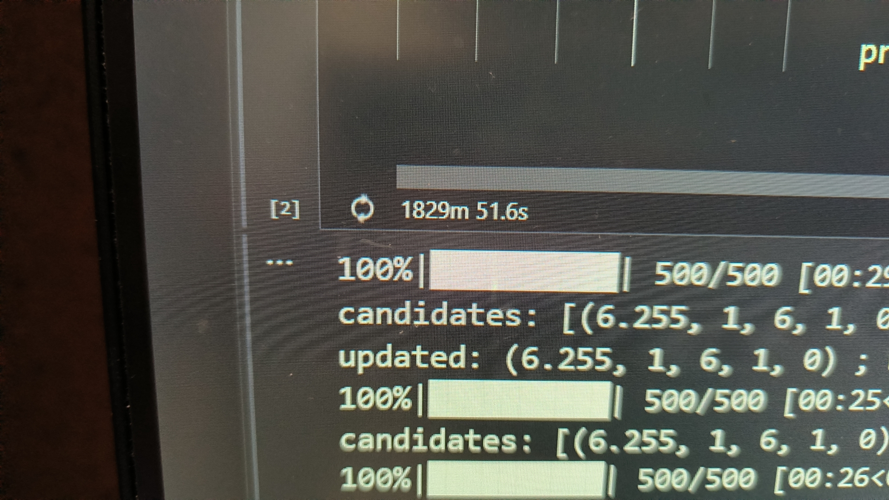

# Hypergraph Neuron Network for TMDB-box-office-prediction

Thank you for your interest in this HGNN approach for the TMDB box office prediction.

## Data: 
"entire.csv" (i.e. with train and test data from kaggle website and also crawled data)

## methodologies:
We adopted an 'multi-channel' HGNN approach based on Graph Convolution Network with 2 convolution layers in each channel.

### node embeddings
19-dim vector: 
[
'budget': log(raw_budget + 1), 
'true_budget': log(1920_budget + 1), where 1920 budget are the raw budget with inflation impact erased,
'popularity': raw data,
'runtime': raw data,
'cast_num': number of cast mentioned in column 'cast',
'crew_num': number of crew mentioned in column 'crew',
'keyword_num': number of keywords mentioned in column 'Keyword',
'spoken_languages_num': number of spoken-languages mentioned in column 'spoken_language',
'production_countries_num': number of production contries mentioned in column 'production_contries',
'production_companies_num': number of production companies mentioned in column 'production_companies',
'genres_num': number of genres mentioned in column 'genres',
'belongs_to_collection_num': number of collections mentioned in column 'belong_to_collections',
'ReleaseYear': 1920-2019,
'ReleaseMonth': 1-12,
'ReleaseDay': 1-31,
'hasHomepage': 1 if a homepage is provided else 0,
'hasTagline': 1 if tagline is provided else 0,
'changedTitle': 1 if 'title' and 'original title' are different else 0,
'originalLanguageEng': 1 if original language is english else 0,
]

the node features are the same in different channels.

### edge determination
channels = {genres, production_companies, production_countries, Keywords, cast, crew}

Take keysords as example:

    AllKeywords = {union set of all keywords mentioned by any movie}
    k: a hyperparam subject to change, default 100
    frequentKeywords = {kw in AllKeywords with top k #{appearance}}
    for (i, kw) in enumerate(frequentKeywords):
        ∀movie ∈ Edge[i] iff kw ∈ movie['Keyword']

genres, production_companies, production_countries works identically as Keywords

for cast, the frequency of each cast SomeCast's single appearance is no longer 1, but instead = max(6-SomeCast['order'], 0)

for crew, the frequency of each crew SomeCrew's single appearance is no longer 1, but instead = int(SomeCrew['job'] in ['Director', 'Producer'])

After above raw construction all done, filter HyperEdges whose degree not in (10, 2000).

### Adjacency matrix
$$V = {allmovies}$$
$$E = {allhyperedges}$$
$$De = degree\ matrix\ of\ hyperedges\ (diagnal)$$
$$Dv = degree\ matrix\ of\ vertex\ (diagnal)$$
$$H = incidence\ matrix, \text { where } H_{i,j}=1 \text { if } V[r] \in E[j] \text { else } 0$$
$$Adj = H*De^{-1}*H^T$$
$$G=Dv^{-\frac{1}{2}}* (A+I)* Dv^{-\frac{1}{2}}$$

### Graph Convolution
x: node embeddings (dim: #{movies}×#{features})
#### 1st layer:
$$x = fullyconnected(indim, latdim)(x)$$
(note: fullyconected layer's nodes are features, not movies(vertices))
$$x = G * x$$
#### 2nd layer:
$$x = fullyconnected(latdim, outdim)(x)$$
(note: fullyconected layer's nodes are features, not movies(vertices))
$$x = G * x$$

### process in batchs:
the approach adopts the idea of transductive learning.
however, we have ~5000 training data(movies) and ~4400 testing data.
this makes testing data takes up a large proportion of the whole.
this might be detrimental to the result of transductive learning.
therefore, processing testing data in batches might be improving this.
for example, if n_batch = 4, then each batch will have ~(5000+4400/4) = 6100 data points.
note that only test data are split into batches. train data is the same across batches.
the output will therefore be the concatenation of all batches.

### training
$$loss = MSELoss$$
$$maxepoch=500$$
note that both the budget and revenue are their log values at this stage.
therefore this is equivalent to using MSLE Loss.

### channel fusing:
aggregate the 6 channels by concatenating the output of all channels then linear regression to get the predicted result.

## hyperparam tuning:
tuned on (n_batch, lat_dim, out_dim, dropout). each combination is repeated 3 times.

here are some of the top results (in the format of (local_MSELoss, n_batch, lat_dim, out_dim)):

[(5.396, 1, 30, 9, 0), (5.421, 1, 40, 9, 0), (5.434, 1, 14, 7, 0.5), (5.436, 1, 12, 7, 0), (5.444, 1, 40, 9, 0), (5.45, 1, 50, 9, 0), (5.452, 1, 50, 7, 0), (5.453, 1, 30, 9, 0.5), (5.463, 1, 40, 7, 0), (5.468, 1, 14, 7, 0), (5.471, 1, 40, 7, 0), (5.472, 1, 50, 9, 0), (5.476, 1, 14, 7, 0), (5.477, 1, 30, 7, 0), (5.486, 2, 30, 9, 0), (5.487, 1, 40, 7, 0), (5.488, 1, 10, 9, 0), (5.489, 1, 30, 7, 0), (5.489, 2, 50, 7, 0), (5.491, 2, 50, 7, 0), (5.492, 1, 30, 9, 0.5), (5.492, 1, 40, 9, 0.5), (5.493, 1, 12, 7, 0), (5.494, 1, 50, 9, 0), (5.498, 1, 30, 9, 0), (5.498, 1, 50, 4, 0), (5.5, 1, 40, 9, 0.5), (5.502, 1, 50, 9, 0), (5.504, 1, 30, 9, 0), (5.505, 1, 40, 9, 0), (5.505, 1, 50, 7, 0), (5.507, 1, 10, 9, 0), (5.507, 2, 40, 9, 0), (5.508, 2, 50, 9, 0), (5.51, 1, 12, 7, 0), (5.51, 1, 30, 5, 0), (5.512, 1, 50, 9, 0.5), (5.512, 2, 30, 7, 0), (5.513, 1, 40, 5, 0.5), (5.513, 1, 40, 9, 0), (5.515, 1, 30, 9, 0.5), (5.515, 1, 40, 9, 0.5), (5.516, 1, 14, 7, 0), (5.518, 1, 8, 9, 0), (5.519, 1, 30, 9, 0.5), (5.523, 2, 40, 9, 0), (5.525, 1, 14, 9, 0), (5.525, 1, 40, 5, 0), (5.526, 1, 12, 9, 0), (5.526, 1, 14, 4, 0), (5.528, 1, 14, 7, 0), (5.529, 1, 12, 7, 0.5), (5.53, 1, 30, 7, 0.5), (5.533, 1, 40, 9, 0), (5.533, 1, 50, 7, 0.5), (5.533, 1, 50, 9, 0.5), (5.535, 1, 12, 5, 0), (5.536, 1, 40, 7, 0.5), (5.537, 1, 30, 7, 0), (5.537, 1, 30, 9, 0), (5.539, 1, 50, 7, 0), (5.539, 2, 14, 7, 0), (5.54, 2, 14, 7, 0), (5.54, 2, 30, 9, 0.5), (5.541, 1, 8, 4, 0), (5.542, 1, 50, 9, 0.5), (5.543, 1, 12, 7, 0), (5.543, 1, 40, 5, 0.5), (5.545, 1, 6, 4, 0), (5.545, 4, 40, 9, 0), (5.546, 1, 12, 9, 0), (5.546, 2, 30, 9, 0), (5.547, 1, 8, 9, 0), (5.547, 1, 12, 9, 0), (5.547, 1, 14, 9, 0), (5.55, 2, 14, 9, 0), (5.55, 2, 40, 9, 0), (5.551, 2, 50, 9, 0), (5.552, 1, 30, 5, 0), (5.553, 1, 10, 5, 0.5), (5.554, 1, 30, 7, 0), (5.554, 1, 50, 3, 0), (5.555, 2, 50, 7, 0), (5.556, 1, 12, 5, 0), (5.556, 2, 12, 7, 0), (5.558, 1, 10, 9, 0), (5.558, 2, 12, 9, 0), (5.56, 1, 50, 7, 0), (5.562, 2, 30, 7, 0), (5.563, 2, 14, 9, 0), (5.565, 1, 8, 9, 0), (5.565, 1, 50, 5, 0),......]

very time-consuming

## kaggle score

the best score is 2.53 with above hyperparam-tuning, but reached 2.382 when using only one conv layer and out_dim=300, n_epoch=5000 (before channel fusing)

